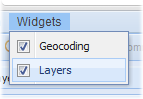

Events for menu' item check
========================================

Below there is a schema that show handlers that manage
the menu' item check event

.. image:: ChangeCheckHandler.png

'GlobalChangeCheckActionHandler' is the tagging super interface
that identifies all handlers that manage checks on a generic menu'
item.

'GeocodingChangeCheckActionHandler' is the interface that specialize
the handler to manage only events fired from geocoding menu' item

.. image:: Geocoding.png

'LayerChangeCheckActionHandler' is the interface that specialize
the handler to manage only events fired from layer menu' item

