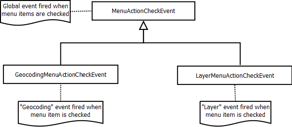

Events for menu' item check
========================================

Below there is a schema that show events fired when a
check menu' item is checked

'MenuActionCheckEvent' is the abstract class that identifies all 
events fired when a check menu' item is checked.

'GeocodingMenuActionCheckEvent' is the class that specialize the
event fired when the geocoding check menu' item is selected

.. image:: Geocoding.png

'LayerMenuActionCheckEvent' is the class that specialize the
event fired when the layer check menu' item is selected

.. image:: Layer.png